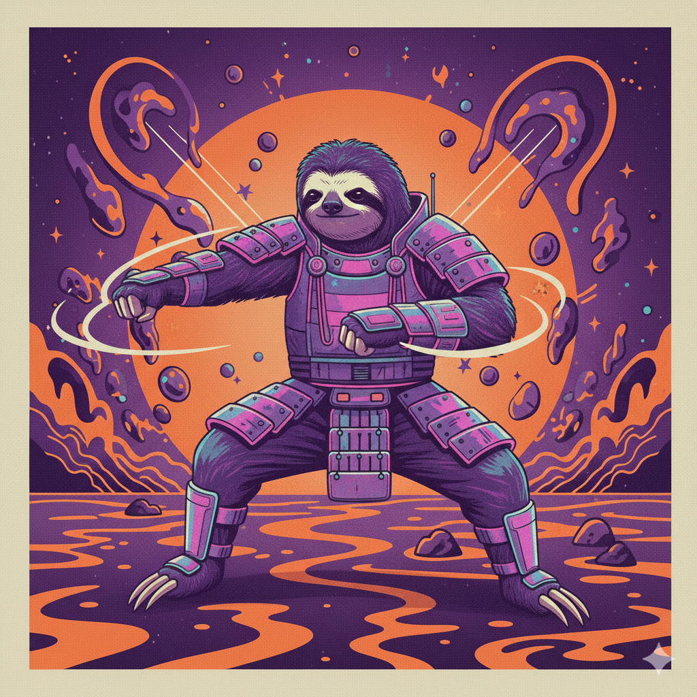

# Kiseki (軌跡)

<div align="center">

</div>
Lightweight motion trajectory visualization -- convert `.npy` motion feature files to animated skeleton videos with minimal dependencies.

The name *Kiseki* means "trajectory" or "path of motion" in Japanese, fitting for a tool that traces and animates skeleton motion paths.

## Features

- **Minimal dependencies** -- only `numpy` and `matplotlib` (no torch or pymotion)
- **Python API and CLI** -- use from code or the command line
- **Camera presets** -- front, back, side, top, three-quarter, and custom angles
- **Focus views** -- zoom into hands, arms, fingers, or upper body
- **Trajectory trails** -- draw the path joints trace over time
- **Motion comparison** -- overlay or side-by-side view of two motions
- **Frame range selection** -- render a specific clip instead of the full sequence
- **Frame grids** -- static PNG grid of key frames
- **Bundled BVH** -- ships with a default skeleton file; no external BVH required

## Installation

```bash
# From source
pip install .

# Development install
pip install -e ".[dev]"

# From GitHub
pip install git+https://github.com/1997MarsRover/kiseki.git
```

## Quick Start

### Python API

```python
from kiseki import visualize

# Basic usage -- generates motion.mp4 next to the input file
visualize("motion.npy")

# Focus on hands with front view
visualize("motion.npy",
          focus_joints='both_hands',
          fixed_view='front',
          fps=60)

# With normalization and frame grid
visualize("motion.npy",
          norm_path="normalization.npz",
          save_grid=True)
```

### CLI

```bash
# Basic usage
kiseki -i motion.npy

# Focus on hands with front view
kiseki -i motion.npy --focus both_hands --view front

# With downsampling and grid export
kiseki -i motion.npy --fps 60 --downsample 2 --grid

# With normalization
kiseki -i motion.npy --norm normalization.npz
```

## Trajectory Trails

Draw the path that selected joints trace over time.

### Python API

```python
from kiseki import visualize

# Preset: wrists
visualize("motion.npy", trails='wrists', trail_length=30)

# Preset: fingertips
visualize("motion.npy", trails='fingertips', trail_length=50)

# Custom joint list
visualize("motion.npy", trails=['left_wrist', 'right_wrist', 'head'])
```

### CLI

```bash
# Preset trails
kiseki -i motion.npy --trails wrists --trail-length 40

# Comma-separated joint names
kiseki -i motion.npy --trails left_wrist,right_wrist
```

### Trail Presets

| Preset            | Joints                                                  |
|-------------------|---------------------------------------------------------|
| `wrists`          | left_wrist, right_wrist                                 |
| `hands`           | wrists + index1, middle1 for each hand                  |
| `fingertips`      | all five fingertip joints per hand                      |
| `feet`            | left_foot, right_foot                                   |
| `all_extremities` | wrists + feet + head                                    |

## Motion Comparison

Compare two motion sequences (e.g. generated vs ground truth).

### Python API

```python
from kiseki import compare

# Overlay -- both skeletons on the same axes
compare("generated.npy", "ground_truth.npy", mode="overlay")

# Side-by-side -- two panels
compare("generated.npy", "ground_truth.npy", mode="side_by_side")

# With labels and fixed view
compare("a.npy", "b.npy",
        mode="side_by_side",
        fixed_view='front',
        label_a="Generated",
        label_b="Ground Truth")
```

### CLI

```bash
# Overlay comparison
kiseki -i generated.npy --compare ground_truth.npy --mode overlay

# Side-by-side comparison
kiseki -i generated.npy --compare ground_truth.npy --mode side_by_side

# With labels
kiseki -i a.npy --compare b.npy --label-a "Gen" --label-b "GT"
```

## Frame Range / Clip Selection

Render only a portion of the motion.

### Python API

```python
visualize("motion.npy", start_frame=50, end_frame=200)
```

### CLI

```bash
kiseki -i motion.npy --start 50 --end 200
```

Frame range works with all other options -- you can combine it with trails, focus, comparison, etc.

## API Reference

### `visualize()`

Main function for creating motion visualizations.

| Parameter        | Type                    | Default | Description                                          |
|------------------|-------------------------|---------|------------------------------------------------------|
| `npy_path`       | str or Path             | --      | Input .npy motion file                               |
| `output_path`    | str or Path or None     | None    | Output video path (default: input_name.mp4)          |
| `bvh_path`       | str or Path or None     | None    | Reference BVH file (auto-detected)                   |
| `norm_path`      | str or Path or None     | None    | Normalization .npz file for denormalization           |
| `fps`            | int                     | 30      | Frames per second                                    |
| `downsample`     | int                     | 1       | Downsample factor for faster rendering               |
| `tracking`       | bool                    | True    | Camera follows the root joint                        |
| `title`          | str or None             | None    | Video title                                          |
| `focus_joints`   | list, str, or None      | None    | Focus on specific joints (see focus groups below)    |
| `fixed_view`     | tuple, str, or None     | None    | Camera angle preset or (elev, azim) tuple            |
| `hand_point_size`| float                   | 8       | Point size for hand/finger joints                    |
| `save_grid`      | bool                    | False   | Also save a frame grid PNG                           |
| `grid_frames`    | int                     | 9       | Number of frames in the grid                         |
| `start_frame`    | int or None             | None    | Start frame index (inclusive)                        |
| `end_frame`      | int or None             | None    | End frame index (exclusive)                          |
| `trails`         | list, str, or None      | None    | Joint names or preset for trajectory trails          |
| `trail_length`   | int                     | 30      | Number of past frames visible in each trail          |

Returns: `Path` to the saved video.

### `compare()`

Compare two motion sequences side-by-side or overlaid.

| Parameter     | Type                    | Default     | Description                                      |
|---------------|-------------------------|-------------|--------------------------------------------------|
| `npy_path_a`  | str or Path             | --          | First .npy motion file                           |
| `npy_path_b`  | str or Path             | --          | Second .npy motion file                          |
| `output_path` | str or Path or None     | None        | Output video path                                |
| `bvh_path`    | str or Path or None     | None        | Reference BVH file (auto-detected)               |
| `norm_path`   | str or Path or None     | None        | Normalization .npz file                          |
| `mode`        | str                     | "overlay"   | "overlay" or "side_by_side"                      |
| `fps`         | int                     | 30          | Frames per second                                |
| `downsample`  | int                     | 1           | Downsample factor                                |
| `start_frame` | int or None             | None        | Start frame index (inclusive)                    |
| `end_frame`   | int or None             | None        | End frame index (exclusive)                      |
| `fixed_view`  | tuple, str, or None     | None        | Camera angle preset or (elev, azim) tuple        |
| `title`       | str or None             | None        | Video title                                      |
| `label_a`     | str or None             | None        | Label for first motion (default: filename stem)  |
| `label_b`     | str or None             | None        | Label for second motion (default: filename stem) |

Returns: `Path` to the saved video.

## Focus Groups

Available focus groups for zooming into specific body parts:

```python
from kiseki import JOINT_GROUPS

print(JOINT_GROUPS.keys())
# dict_keys(['left_hand', 'right_hand', 'both_hands',
#            'left_arm', 'right_arm', 'both_arms',
#            'upper_body', 'fingers'])
```

You can also pass a list of joint indices directly:

```python
visualize("motion.npy", focus_joints=[20, 21, 22, 39, 40, 41])
```

## Camera View Presets

Available camera view presets:

| Preset          | Description                       |
|-----------------|-----------------------------------|
| `front`         | Looking at the front of the body  |
| `back`          | Looking at the back               |
| `side`          | Right side view                   |
| `left_side`     | Left side view                    |
| `top`           | Top-down view                     |
| `front_down`    | Slightly elevated front view      |
| `three_quarter` | 3/4 view from the right-front     |

Custom angles are also supported as `(elevation, azimuth)` tuples:

```python
visualize("motion.npy", fixed_view=(30, 90))
```

## Project Structure

```
kiseki/
  __init__.py      Package init and public exports
  api.py           Main visualize() entry point
  compare.py       Motion comparison (overlay / side-by-side)
  visualize.py     Animation and frame grid rendering
  core.py          Quaternion ops, BVH parser, motion reconstruction
  cli.py           Command-line interface
  sample.bvh       Bundled default skeleton file
```

## Dependencies

- Python >= 3.8
- numpy >= 1.20.0
- matplotlib >= 3.3.0

No torch. No pymotion. Quaternion operations and BVH parsing are implemented from scratch in pure numpy.

## License

MIT License

## Contributing

Contributions are welcome. Please feel free to submit a pull request.

## Changelog

### v0.1.0

- Pure numpy quaternion operations (no torch dependency)
- Built-in lightweight BVH parser (no pymotion dependency)
- Bundled sample.bvh as default skeleton
- Modular package structure with Python API and CLI
- Camera view presets and focus groups
- Trajectory trails for visualizing joint paths over time
- Motion comparison: overlay and side-by-side modes
- Frame range / clip selection
- Frame grid generation
